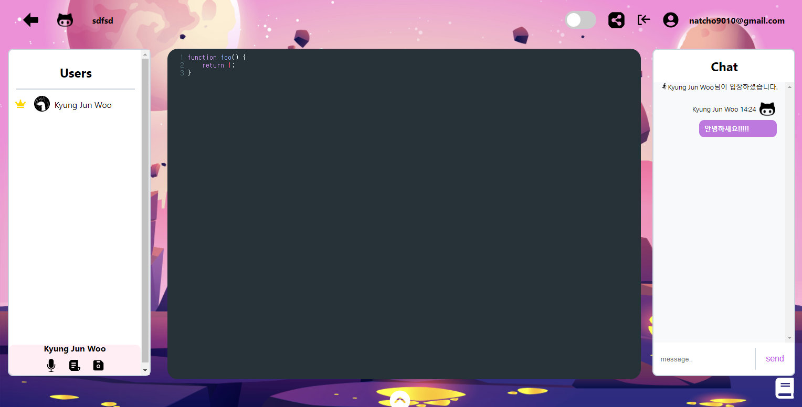
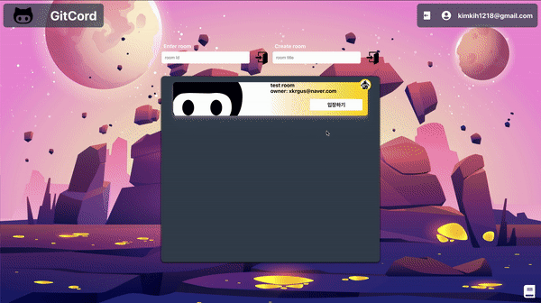
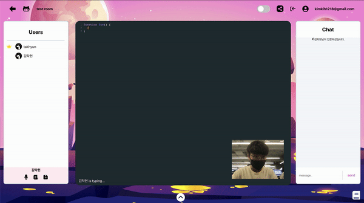
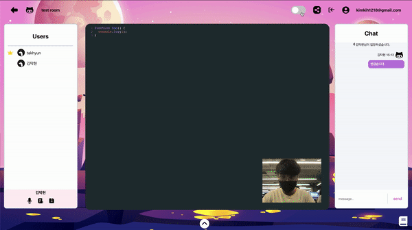
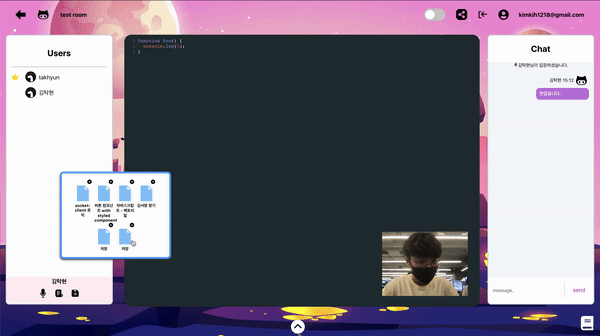

# GitCord

<p align="center"></p>

GitCord는 하나의 방에 여러 유저들이 모여 **실시간으로 음성, 화상으로 소통하며 코드를 작성할 수 있는 웹 어플리케이션입니다.**

👉Frontend Address: <a href="https://github.com/VanillaGitCord/GitCordFront">https://github.com/VanillaGitCord/GitCordFront</a>

👉Backend Address: <a href="https://github.com/VanillaGitCord/GitCordBack">https://github.com/VanillaGitCord/GitCordBack</a>

## Motivation

1. 웹의 장점: 앱 어플리케이션과 비교했을 때 웹 어플리케이션의 장점은 접근성과 편리함 보단 <b>"생산성"</b>이라고 생각했고,

2. 핫한 플랫폼: 생산성에 부합하는 아이템들 중, 최근 코로나로 전 세계가 **온라인 화상과 자료 공유 플랫폼**에 관심이 많아지는 만큼 해당 분야의 아이템을 생각했습니다.

3. 블루오션: 온라인 화상 플랫폼 중에서도 기존의 Zoom이나 다른 화상 플랫폼을 클론하기 보단 <u>**시중에 없는 아이템을 찾아 고민**</u>했고
**Github나 Codepen같은 code editing 플랫폼을 <u>실시간</u>으로 함께 소통할 수 있는 플랫폼**이 있으면 좋겠다는 생각을 가지고 기획 되었습니다.

# Features

- 로컬 회원 가입 / 로그인 기능
- 구글 소셜 로그인
- 캠 기능 (방장만 가능)
- 마이크 기능 및 음소거 기능
  (모든 유저는 마이크 기능을 사용할 수 있으며, 방장은 마이크와 함께 캠을 끌 수 있습니다)
- 코드 에디터 기능 (자바스크립트 지원)
- 채팅 기능
- 코드 저장하기 기능
- 저장한 코드 불러오기 기능
- 채팅 기능
- 방 URL 클립보드 copy 기능
- 화이트 보드 기능 (color picker & All clear 내장)

# Demo

## Enter Room



## Type Code & Chat



## White Board



## Delete & Load code



# How to use

Client
```
  git clone https://github.com/VanillaGitCord/GitCordFront.git
  npm install
  npm start
```

Server
```
  git clone https://github.com/VanillaGitCord/GitCordBack.git
  npm install
  npm run dev
```

# stack

Clinet
  - React
  - React router
  - Redux
  - lodash
  - socket.io-client
  - WebRTC
  - simple-peer
  - styled-components
  - codeMirror
  - cypress

Server
  - argon2
  - Express.js
  - json web token
  - mongoDB Atlas
  - mongoose
  - socket.io

## Deploy

### Frontend
- Netlify를 이용하여 애플리케이션 배포 및 관리

### Backend
- AWS Elastic Beanstalk를 사용하여 애플리케이션 배포 및 관리
- Amazon ACM (AWS Certificate Manager)을 사용하여 SSL 관리 (HHTPS 프로토콜)

## Chanllenge

### React 렌더링과 socket 이벤트

- 렌더링에 독립적인 socket 이벤트 설계

  리액트 특성 상 state 값의 변화에 따라서 계속 재렌더링이 되며
  이 때마다 계속 Component안의 socket 이벤트가 발생되고 다시 삭제되는
  불필요한 행위가 지속되었습니다.

  한 컴포넌트에 필요한 socket 이벤트를 외부파일 한 곳에 모아놓고 컴포넌트 Mount시에 해당 파일을 import 및 실행하여 필요한 socket 이벤트를 생성하여 사용하였습니다.
  동시에 socket 이벤트에서 받는 Data들을 Redux로 관리하도록 하여 **안정적으로 socket 이벤트를 실행하고 깔끔하게 Redux 한 곳에서 데이터를 관리할 수 있게 되었습니다.**

- 비동기 Dispatch와 socket 이벤트 관리

  방장이 떠나게 될 경우, 기존 방 내에 있는 참여자들도 같이 channel 선택창으로
  이동한 후 다시 방장이 룸을 만들 경우 방이 만들어지고 바로 퇴장을 당하는 문제가 있었습니다.
  해당 문제는 socket.io의 로직이 비동기적으로 동작된다는 점이 문제가 됬고,
  redux의 dispatch 함수가 socket.io의 on emit 로직보다 더 빨리 실행되는게 문제의 원인이었습니다.

  문제 해결을 위해 방장이 나갈 경우 redux에서 상태값에 변화를 주면 해당 방에 그 상태 값을 통해
  퇴장 전 로딩 컴포넌트를 띄우고 해당 컴포넌트에서 useEffect를 통해 다시 redux의 상태값을
  초기 상태로 되돌리는 방식으로 flow를 형성하여 문제를 해결했습니다.

### socket 통신 최적화

- 중첩되는 onchange 이벤트와 Code Editor 내용 갱신 Delay 해결

  GitCord는 Code Editor에 타이핑을 했을 때, socket server를 통해 갱신된 Code Editor의 내용이 모두에게 전달되도록 설계가 되어있습니다.
  이때, 사용자의 너무 빠른 타이핑이나 빠르게 중복되는 onChange 이벤트로 인해 socket server에 Delay가 생겨 Code editor 내용 적용이 늦어지는 경우가 발생했습니다.

  이런 문제는 배포하였을 때, local보다 서버 성능이 상대적으로 좋지 않기에 더욱 두드러지게 나타났습니다.

  이를 lodash의 throttle을 이용해 갱신 반응이 느려질 수 밖에 없지만, 이벤트 중복이 많이 발생하여도 안정적으로 socket 이벤트와 통신 할 수 있도록 해결했습니다.

### React Component 최적화

  GitCord는 하나의 Main Component에 Chat, UserList, CodeEditor, CamWindow가 있고 모두 Dynamic한 Component이기 때문에 최적화가 꼭 필요했습니다.

### React와 Peer to Peer 연결

- React Rendering 이벤트와 Peer 연결 이벤트

  Gircord는 방 참여자가 각각 음성과 영상을 주고 받을 수 있는
  **다대다 Peer 접속**이기 때문에, <u>단 한번</u>의 media streaming 이벤트와 그 stream 객체를 주고
  받을 수 있는 Peer signaling 이벤트와 signal을 주고 받는 socket 이벤트를 단 한번씩만 선언하여 가지고 있어야 합니다. 여러번 이벤트가 유발되었을 경우에 다수의 signal 이벤트 유발로 한 유저의 signal이 여러개가 생성 및 전달 되어
  반대편에서 Peer 접속에 혼선이 유발 되어 접속이 원활히 이루어 질 수 없습니다.

  사용자가 Main 컴포넌트에 사용자가 접근했을 때, media streaming 발생 이벤트와 Signaling 이벤트를
  유발 시켰는데, **리액트 특성상 여러번의 렌더링으로 여러번의 Peer 이벤트가 실행되어 사용자간 Peer 접속에 어려움을 겪었습니다.**

  처음에 signal 이벤트와 전달, 접속 원리를 이해하지 못하여 전달 이벤트를 Debugging하며 흐름을 파악했고,
  Peer를 연결하기에 모든 데이터가 준비 되었을 때, 유발시키고 유발하는 즉시 isReady라는 state를 true로 바꾸어
  re-render가 되더라도 다시는 실행되지 못하게 하여 해결하였습니다.

### 무단 접근 방지

- React Redirect, Link 접근 이외의 접근 방법 방지

  설정해준 Redirect, Link tag를 통해서 접근시에 Component의 useEffect가 모두 실행되어 필요한 데이터를 모두
  불러올 수 있는 반면, window.history, window.location.href, url 직접 입력 등을 통해서 접근하는 방법들은
  Mount시의 useEffect와 Redux 이벤트를 실행시키지 못하기 때문에 페이지가 제대로 초기화 되지 못하는 문제가 있었습니다.

  따라서, Redirect 혹은 Link 시에 "authRouting"이라는 flag를 주어 사용자가 제대로된 경로를 통해 접근했다는 사실을 알렸고
  그렇지 않은 경우에는 Error로 Redirect하도록 처리하여 접근을 방지했습니다.

### 완전 동시 수정과 y-codemirror (진행중...)

- CodeMirror 실시간 편집

  기존의 CodeMirror는 textArea에 내용을 받아 새로 CodeMirror를 그려주는 방식으로 되어있어
  사용자가 typing시에 codeMirror의 content를 socket으로 전송해 방 참여자들에게 뿌려주는 방식으로 공유하였습니다.

  이 방법은, 동시에 여러 참여자들이 편집을 진행 할 시, content의 전송속도보다 사용자 각자의 typing이 빠른 경우
  content가 왜곡될 수 있다는 단점이 있고, 커서의 위치 또한 왜곡되거나 text의 마지막으로 정렬되어 버리는 문제가 있었습니다.

  Google Docs 처럼 참여자 모두가 동시에 내용을 수정 할 수 있는 방법을 찾아 고민했고 Yjs라는 동시 작업이 가능한
  Document 자료구조를 발견, Yjs를 적용한 y-codemirror을 적용하고자 하였습니다.

  **y-codemirror는 참여자의 codeMirror를 각각 Peer to Peer로 연결하여 사용자들이 동시에 편집하여도 모두 적용되는 라이브러리입니다.**

  하지만 y-codemirror는 Peer to Peer 시그널링을 위해 <u>반드시 ws:// 혹은 wss:// 프로토콜의 새로운 Web Socket 서버가 필요</u>했고
  기존의 Express 서버와 aws서버에 적용하려 한 결과, 여러가지 문제가 발생하여 해결하는 중에 있습니다

  ### 해결을 위한 시도들

  1. 기존 Express 서버와 같은 port로 통합 -> 기존 Socket.io와 충돌

  2. socket.io에 web socket 이벤트 로직 심어넣기 -> 해당 이벤트에 응답 없음

  3. 기존 Express 서버와 포트를 다르게해 함께 배포, 포트 각각 설정 -> aws 통신 실패

  4. localhost:4444에 실행 후 ngrok을 통한 port forwading -> http만 forwarding 됨으로 y-codemirror 서버 설정 실패

  5. 새로운 websocket 서버를 배포 (아직 시도 해보지 않음...)
