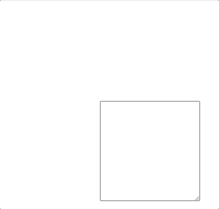
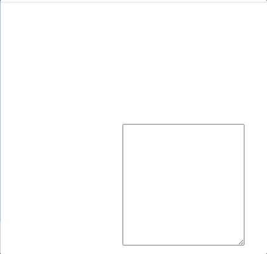
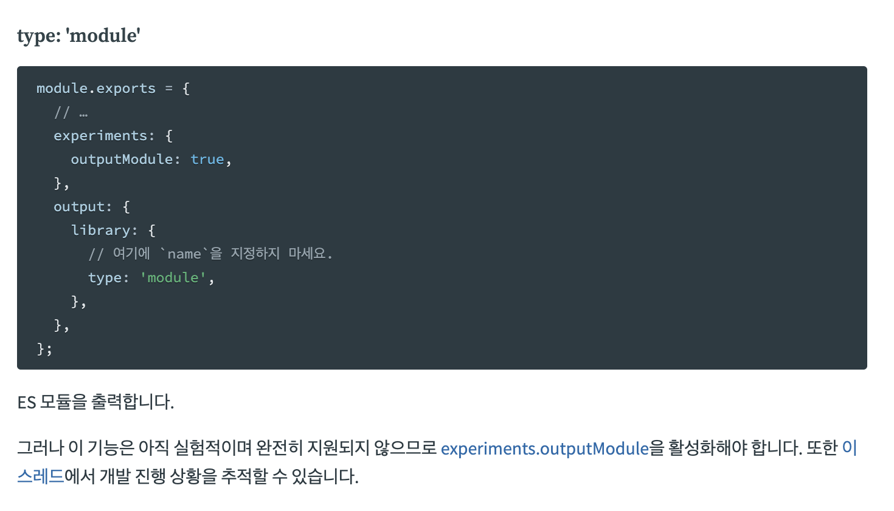
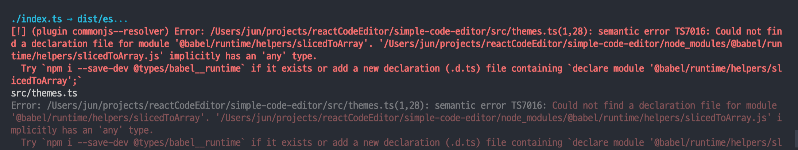

npm으로 간단하게 설치해서 사용할 수 있는 react-web-code-editor 개발기입니다!

**2022년 1월 ~ 3월 v.1 개발** 그리고 **4월 ~ 5월 v.2 개발**로 좀 늦은 후기이지만, 올려보겠습니다! 🙌


<!--more-->

# 🧐 개발 동기

코드 에디터를 만들어보자! 라는 개발 동기는 제 첫 프로젝트와 관련있습니다.

바닐라 코딩 부트캠프 당시에 "GitCord"라는 실시간 개발자 협업 애플리케이션을 개발했던 경험이 있습니다.

3주라는 짧은 기간때문에, 코드 에디터를 "Code mirror"라는 라이브러리를 사용해 완성했었는데, 원래는 코드 에디터까지 직접 개발하는 것이 계획이었어서 아쉬움이 많이 남았습니다.

따라서, 이번 기회에 모두가 사용할 수 있는 라이브러리 형태의 코드 에디터를 만들기로 결정했습니다. 🙌

## 그 외, 개발 목표!

그 외에도 코드 에디터 라이브러리 개발을 통해 얻고자 하는 것들이 있었습니다.

(역시 사이드 프로젝트는 재미와 함께 긍정적인 목표들도 함꼐 이룰 수 있는 것 같아 좋은 것 같습니다! 😆)

- 오픈 생태계를 좀 더 경험하고 싶었다.
- 스스로 문제를 정의하고, 기술적으로 문제를 풀어내는 경험을 해보고 싶었다!
- 라이브러리 배포와 관련 기술들을 경험해보고 싶었다.
- 누구나 사용할 수 있도록 적절히 추상화해보는 경험과 다른 사람들의 로직에 간섭하지 않도록 데이터와 로직을 확실하게 캡슐화해보는 경험을 해보고 싶었다.

# 🎯 개발 목표!

개발 전 어떤 사람들이 사용할 것인지, 어떤 기능을 구현할 것인지에 대해 간단히 정리했습니다!

## 👨‍👩‍👧‍👦 예상한 사용자들

react-code-editor 라이브러리는 Visual Studio Code같은 현업에서도 쓰는 Super Editor는 아니지만, **어디서든 사용할 수 있는 메모장 같은 느낌의 코드에디터**를 목표로 개발했습니다.

메모장이나 포스트 잇처럼 사용해주셨으면 하는 마음이었습니다. 😊

(의도대로라면 chrome extension으로 확장도 가능하지 않을까?! 라는 생각도 있습니다.)

## ⚙️ 차별화된 특징

여러 code editor가 있지만 그 중에서도 가장 특별하고 유용한 기능을 생각했습니다! 🤩

- custom theme, code syntax styling 기능

사용자가 code-editor의 전체적인 테마와 code syntax들의 style을 적용할 수 있도록 지원하고 있습니다!

아래는 customTheme을 적용한 데모입니다.


```tsx
import React from "react";
import "./App.css";
import CodeEditor, { addTheme } from "react-web-code-editor";

/* this custom theme name is "customeTheme" */
addTheme("customTheme", {
  backgroundColor: "Black",
  caretColor: "White",
  textColor: "LightGreen",
  keywords: {
    boolean: "Pink",
    number: "Yellow",
    string: "Green",
    comment: "Violet",
    function: "White",
    keyword: "Blue",
    ["class-name"]: "LightCoral",
    property: "MediumSeaGreen",
    operator: "Cyan",
    punctuation: "Red",

    /* in Example, you can see upper style from this line has been applied */

    prolog: "AliceBlue",
    doctype: "Beige",
    variable: "Wheat",
    cdata: "Brown",
    tag: "Olive",
    constant: "DeepPink",
    symbol: "Indigo",
    deleted: "Blue",
    selector: "DarkGreen",
    ["attr-name"]: "ForestGreen",
    char: "Ivory",
    builtin: "Linen",
    inserted: "MediumSpringGreen",
    entity: "BurlyWood",
    url: "RoyalBlue",
    ["language-css"]: "AliceBlue",
    style: "Chocolate",
    /* you can use "Hex color code" */
    atrule: "#a74a4a",
    ["attr-value"]: "#000000",
    /* you can use "rgb" or "rgba" code */
    regex: "rgb(0,0,0)",
    important: "rgba(167,74,74,0.6)",
  },
});

function App() {
  return (
    <div className="App">
      <header className="App-header">
        {/* now, you can use "customTheme" */}
        <CodeEditor theme="customTheme" width="210px" height="210px" />
      </header>
    </div>
  );
}

export default App;
```

그 외의 기능들은 라이브러리 소개는 github repo의 [README](https://github.com/Jay-WKJun/react-web-code-editor)에서 자세히 소개하고 있습니다! 👈

# 📚 개발 Log

여기선 개발하면서 있었던 여러가지 이야기를 해보려고 합니다.

## pre 태그

> HTML <pre> 요소는 미리 서식을 지정한 텍스트를 나타내며, HTML에 작성한 내용 그대로 표현합니다. 텍스트는 보통 고정폭 글꼴을 사용해 렌더링하고, 요소 내 공백문자를 그대로 유지합니다. - MDN

textArea를 통해 입력한 글자를 그대로 표현하기 위해 pre 태그를 활용했습니다.

### div와 pre의 차이

div  | pre
------------- | -------------
  | 

## rollup.js

react-web-code-editor v.1의 번들러는 webpack 🗳이었습니다.

하지만 v.2에서 rollup 🗞 으로 번들러를 교체하였는데요!

그 이유와 rollup 적용기에 대해 말씀드리겠습니다! 🙌

### Tree Shaking

> It relies on the import and export statements in ES2015 to detect if code modules are exported and imported for use between JavaScript files. mdn/glossary/tree-shaking

사용자는 제 라이브러리를 최대한 가볍게 사용하길 원합니다.

따라서 사용자가 사용한 기능만 제공해주는 것이 가장 바람직합니다.

여기서 **Tree Shaking**이라는 개념이 나옵니다.


Tree Shaking이란 나무를 흔들어 필요없는 낙엽을 떨어뜨리는 것처럼,

사용되지 않는 코드를 번들에 포함시키지 않도록 하여 최대한 번들을 가볍게 하는 것을 말합니다.

이 Tree Shaking은 ES Module을 통해 가능합니다.

### ESModule

Module 시스템은 여러가지 방식으로 구현되어 있습니다.

그 중 ES Module만이 Tree Shaking 방식인 것일까요??

그건 바로 ES Module이 **static module structure**이기 때문입니다.

(반면, CommonJS는 dynamic한 구조입니다.)

**static하다**는 것은 <u>각 module간의 import와 export가 compile time에 정해진다는 것을 의미합니다!</u>

즉, 코드를 실행시켜보지 않아도, 어떤 module에서 무었을 가져왔는지, 코드만 보고 모두 상세하게 파악할 수 있다는 것입니다.

빌드 전에 모듈들의 관계를 모두 파악할 수 있으니, 모듈에서 어떤 것이 쓰이고 어떤 것이 쓰이지 않는지까지 파악할 수 있습니다.

따라서, 쓰이지 않는 코드는 빌드에 포함시키지 않을 수 있는 것이죠! (Tree Shaking!)

```typescript
import { debounce } from 'lodash';

if (Math.random()) {
  // 불가능!!
  // import { debounce } from 'lodash';
}
```

여기서, ES Module은 static module structure를 위해 import와 export를 반드시 module의 첫 부분에 지정해줘야합니다.

그래야, 내가 작성한 코드를 실행해보지 않아도 모듈간의 관계를 파악할 수 있기 때문입니다.

(조건부로 import할 수 있는 dynamic imports도 존재합니다!)

### CommonJS

반면, dynamic한 경우 코드를 실행시켜보지 않으면, 알 수 없다고 하는 것일까요??

예제 코드를 보겠습니다.

```typescript
let someVar;
if (Math.random()) {
  someVar = require('foo');
} else {
  someVar = require('bar');
}
```

조건부로 foo 모듈과 bar 모듈을 불러오고 있습니다.

여기서 Math.random 함수를 실행해보지 않고는 어떤 module을 불러와야 할지 모르기 때문에, foo와 bar 모듈 모두를 불러올 수 밖에 없습니다.

### Webpack을 rollup으로 교체한 이유

**webpack은 강력한 번들러이지만, 교체한 이유는 ES Module 형식의 번들을 rollup.js가 더 안정적으로 지원해주기 때문입니다.**

그리고 관련 plugin도 rollup.js가 더 풍부합니다!

아쉽지만, 글을 쓰는 2022년 8월 현재 webpack은 ES Module 형태로 번들해주는 기능이 experimental입니다.

(https://webpack.kr/configuration/output/#type-module)



## rollup.js 적용기

본격적으로 rollup.js 적용기를 말씀드려보겠습니다.

rollup에서 몇가지 plugin들을 사용했었는데, 적용 과정에서 몇가지 issue가 있었습니다!

### plugin-node-resolve

가장 첫번째로 만난 **"'react' 모듈을 찾을 수 없습니다."** 에러! (아쉽게도 자료화면이 없네요...ㅠ)

plugin-node-resolve로 해결했습니다.

rollup은 import 'react'에서 'react'라는 절대경로 방식의 path 설정을 이해하지 못합니다.

따라서, 이런 node_modules안에 있는 3rd-party dependency들을 모두 resolve한 후에 본격적인 번들링이 진행돼야하는데, plugin-node-resolve가 [Node resolution 알고리즘](https://nodejs.org/api/modules.html#modules_all_together)을 통해 이 역할을 수행해 줍니다.

(external이라는 Rollup config를 통해서도 할 수 있지만,,,,,,, 플러그인 개발자님 감사합니다. 🙏)

여기서 resolve한다는 것은 node resolution 알고리즘을 통해 코드에서 import한 3rd-party dependency들을 하나로 모아주고, rollup에게 'react' 모듈을 어떻게 찾을 수 있는지 알려주는 것을 말합니다.

### rollup-plugin-typescript2 & @rollup/plugin-commonjs

rollup-plugin-typescript2는 번들링 중에 TypeScript로 작성된 코드를 .tsconfig를 이용해 JavaScript 코드로 변환해줍니다.

@rollup/plugin-commonjs는 commonjs로 된 module을 Rollup이 이해할 수 있는 ES6로 바꿔주는 플러그인 입니다.

### 플러그인 순서 이슈



이슈가 또 터졌습니다...! 🤯

에러 메세지를 읽어보니, commonjs 플러그인에서 내보내는 에러입니다.

.d.ts 파일을 찾을 수 없다고 하네요. 🥲

**원인은 플러그인의 순서 였습니다.**

typescript 플러그인에선 TypeScript 변환과 함께, tsconfig 옵션에 따라 d.ts 파일도 만들어 줍니다.

하지만, typescript 플러그인을 먼저 실행하지 않고, commonjs 플러그인을 먼저 실행하니 d.ts 파일이 없어 코드를 더 이상 못읽게 된 것입니다.

차례대로 코드를 읽는 특성상 플러그인의 순서에도 주의를 해야겠습니다. 🥲

### peer dependency와 plugin

해당 라이브러리를 사용하는 사람들은 반드시 React를 사용해야 하기 때문에, 라이브러리의 크기를 줄이기 위해서, React와 React-DOM을 peer dependency로 설정했습니다.

또한, styled-components도 peer-dependency로 설정했습니다.

peer-dependency를 적용함으로서,

- 라이브러리를 더욱 가볍게 할 수 있게 됐고,
- 사용자가 사용하는 dependency들과의 불필요한 충돌을 막을 수 있게 되었습니다.

하지만, peer-dependency만 설정한다고 해서 rollup이 자동으로 bundle에서 제외시켜주지는 않습니다.

따라서, **rollup-plugin-peer-deps-external**를 사용했습니다.

이 플러그인은 peer-dependency에 적용된 dependency들을 자동으로 번들에서 제외시켜주는 플러그인 입니다.

## rollup 교체 후 비교

(직접 적용해보니 이랬다는 후기와 그림들)

# 후기

## ref

https://exploringjs.com/es6/ch_modules.html#static-module-structure

https://hacks.mozilla.org/2018/03/es-modules-a-cartoon-deep-dive/

https://so-so.dev/web/tree-shaking-module-system/

https://web.dev/commonjs-larger-bundles/

https://bitsofco.de/what-is-tree-shaking/

https://flaviocopes.com/es-modules/
