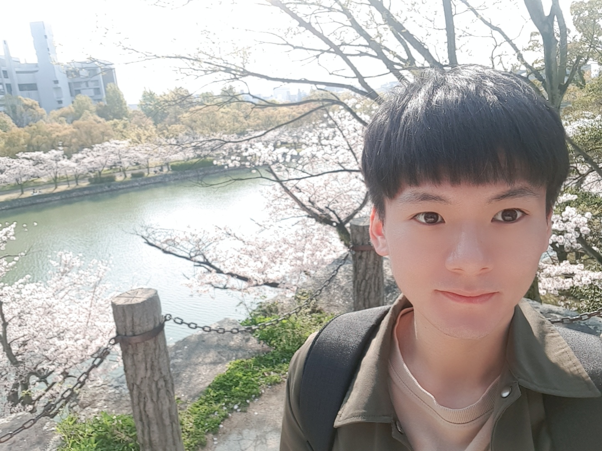

# Woo KyungJun

<b>👨‍💻 Software & Web Developer</b>

Github: <a href="https://github.com/Jay-WKJun">https://github.com/Jay-WKJun</a>

E-mail: natcho9010@gmail.com

- Javascript
- React.js
- Node.js
- Express.js
- Mongo DB

## I'm (a developer)

- **Quick learner**

- Pursue the **clean code** that is read easily like a story book

- Always think How to **Solve the problems correctly & effectively**

## I always aim to be

- **Good Colleague** want to work with and trusted

- a developer can **Provide Helpful/Joyful Program** to people

### Thank you!
